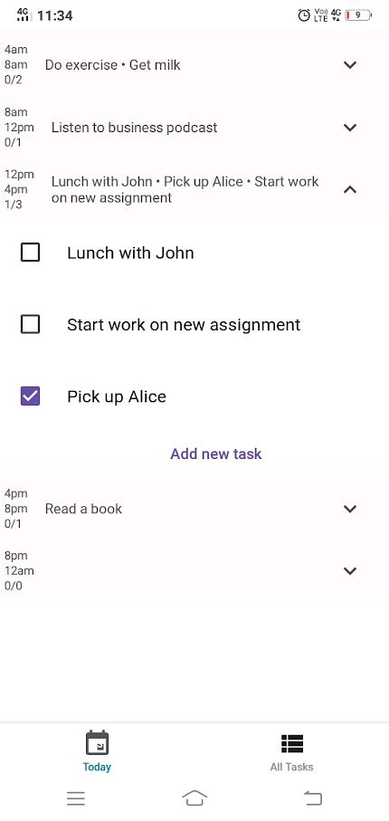

# GoDo
GoDo is a day planner that allows you to plan your agenda in 5 4-hour-long time blocks. Each time block can have at most 6 tasks. The idea is to get you to focus on a few important things in any part of the day.

# Screenshot

